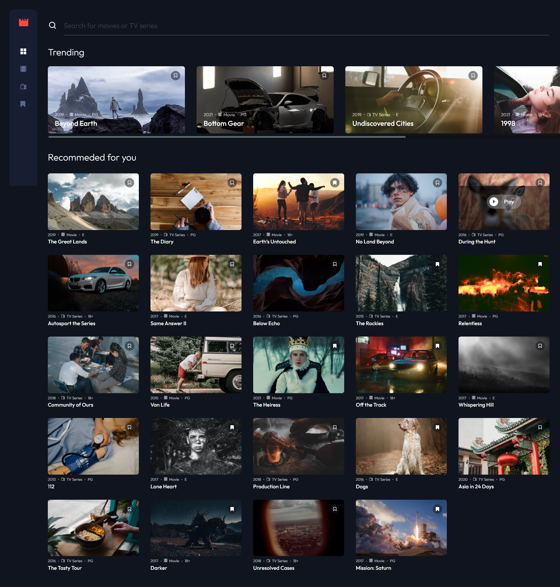

# Frontend Mentor - Entertainment web app solution

This is a solution to the [Entertainment web app challenge on Frontend Mentor](https://www.frontendmentor.io/challenges/entertainment-web-app-J-UhgAW1X). Frontend Mentor challenges help you improve your coding skills by building realistic project.

## Table of contents

- [Frontend Mentor - Entertainment web app solution](#frontend-mentor---entertainment-web-app-solution)
  - [Table of contents](#table-of-contents)
  - [Overview](#overview)
    - [The challenge](#the-challenge)
    - [Screenshot](#screenshot)
    - [Links](#links)
  - [My process](#my-process)
    - [Built with](#built-with)
    - [Useful resources](#useful-resources)
  - [Author](#author)

## Overview

### The challenge

Users should be able to:

- View the optimal layout for the app depending on their device's screen size
- See hover states for all interactive elements on the page
- Navigate between Home, Movies, TV Series, and Bookmarked Shows pages
- Add/Remove bookmarks from all movies and TV series
- Search for relevant shows on all pages

### Screenshot

### Links

- Solution URL: [Visit](https://github.com/KhoiNgD/entertainment)
- Live Site URL: [Visit](https://khoind-entertainment.netlify.app/)

## My process

### Built with

- Semantic HTML5 markup
- CSS custom properties
- Flexbox
- CSS Grid
- Desktop-first workflow
- [React](https://reactjs.org/) - JS library
- [Styled Components](https://styled-components.com/) - For styles

### Useful resources

- [Input Props with Typescript](https://dev.to/giselamd/creating-a-react-input-component-in-typescript-hai) - This helped me for creating Input props type with typescript. I really liked this pattern and will use it going forward.
- [Responsive picture](https://css-tricks.com/responsive-images-css/) - This helped me for creating repsonsive images using picture and source tags.
- [Negative CSS variable](https://stackoverflow.com/questions/49469344/using-negative-css-custom-properties) - This is an amazing article which helped me knowing how to use negative with CSS variable.

## Author

- Frontend Mentor - [@KhoiNgD](https://www.frontendmentor.io/profile/KhoiNgD)
